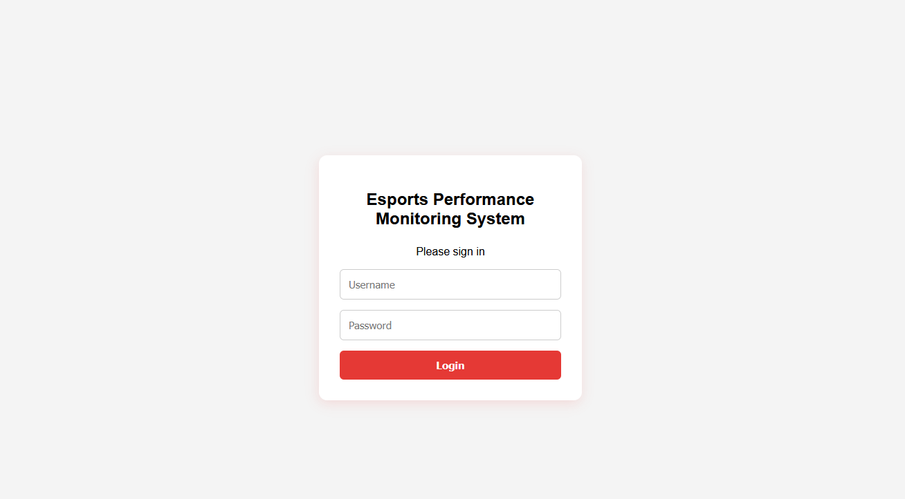
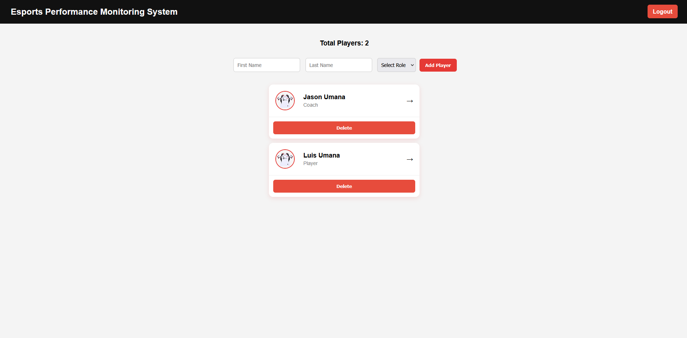
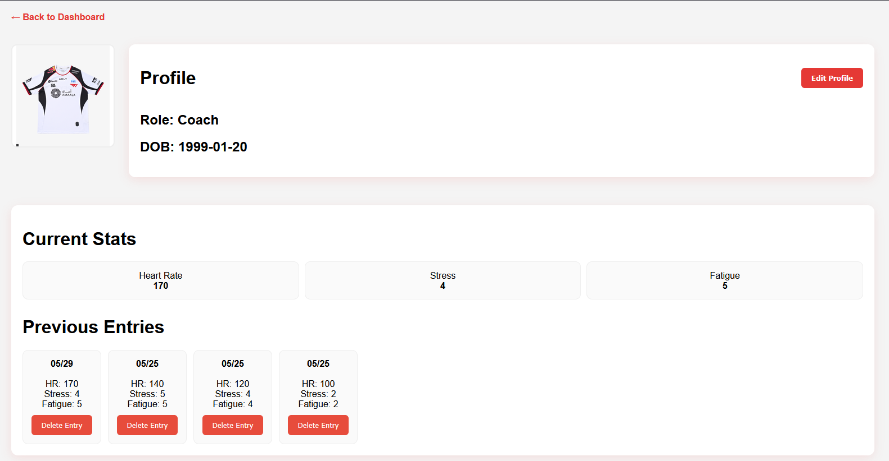
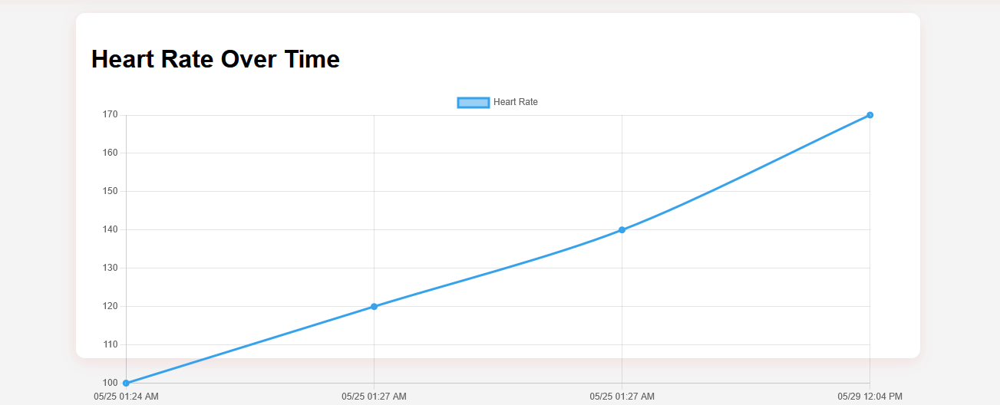
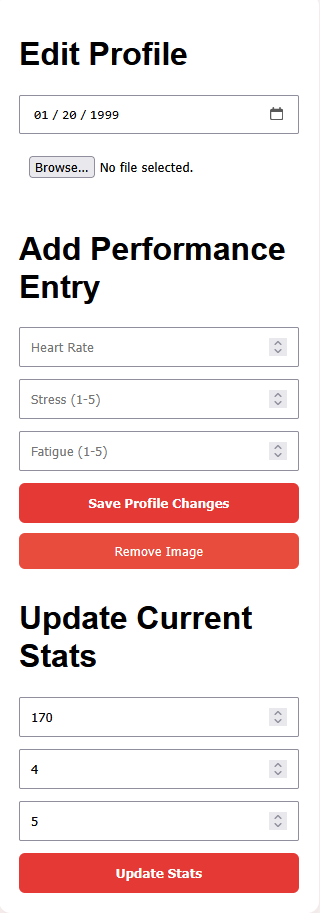

# Esports Performance Monitoring System

A full-stack web application built with Flask and SQLAlchemy for tracking esports player performance metrics and wellness data.

## Overview

The Esports Performance Monitoring System allows coaches and team staff to manage player profiles, monitor performance trends, and track wellness indicators over time. 
The application provides a centralized dashboard for viewing player information, recording performance entries, and visualizing data through interactive charts.

## Features

- User authentication and session management
- Create, view, and delete player profiles
- Upload and manage player profile images
- Track player metrics including:
  - Heart Rate
  - Stress Level
  - Fatigue Level
- Update current player statistics
- View historical performance entries
- Delete individual performance records
- Interactive performance visualization using Chart.js
- Responsive dashboard interface
- SQLite database integration using SQLAlchemy ORM

## Technologies Used

### Backend
- Python
- Flask
- SQLAlchemy
- SQLite

### Frontend
- HTML
- CSS
- JavaScript
- Chart.js

### Other Tools
- Git
- GitHub

## Screenshots

### Login



### Dashboard



### Player Profile



### Performance Graph



### Edit Button



## Project Structure

```text
esports-performance-monitoring-system/
│
├── app.py
├── templates/
│   ├── index.html
│   ├── login.html
│   └── player.html
│
├── static/
│   └── uploads/
│
└── instance/
```

## Installation

### Clone Repository

```bash
git clone https://github.com/0mly/esports-performance-monitoring-system.git
```

### Navigate to Project Folder

```bash
cd esports-performance-monitoring-system
```

### Install Dependencies

```bash
pip install flask flask_sqlalchemy
```

### Run Application

```bash
python app.py
```

Application will be available at:

```text
http://127.0.0.1:5000
```

## Future Improvements

- Search and filter players
- Role-based user accounts
- Advanced analytics dashboard
- Export reports to PDF
- Cloud database integration
- Team and roster management
- Performance alerts and notifications

## What I Learned

Through this project I gained hands-on experience with:

- Full-stack web development
- Flask routing and application structure
- Database design with SQLAlchemy
- CRUD operations
- Session authentication
- File uploads and management
- Data visualization with Chart.js
- Git and GitHub version control

## Author

**Jason Umana**

Bachelor of Science in Computer Information Systems

Open to internships, job shadowing opportunities, and junior software development roles.
